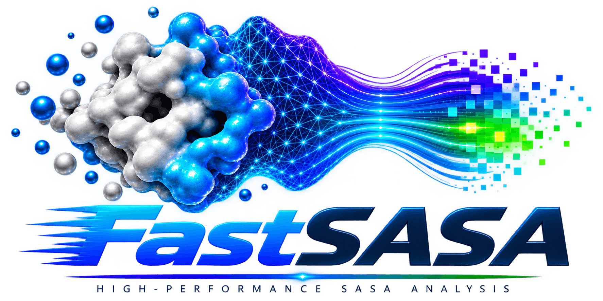

# FastSASA Documentation

<p align="center">
  
</p>

FastSASA calculates solvent-accessible surface area for molecular structures
and molecular dynamics trajectories. It includes Shrake-Rupley and
Lee-Richards algorithms, direct DCD/XTC trajectory processing, a Python array
API, and feature extraction for exposure and interface analysis.

FastSASA uses an available Vulkan, CUDA, or threaded CPU backend automatically.
You can run the same command on a workstation GPU or on a CPU-only machine.

## Build From Source

Requirements: CMake 3.18 or newer and a C/C++ compiler. GPU support is
optional. Vulkan builds also need Vulkan headers and `glslc`; CUDA builds need
the CUDA toolkit.

Default build (includes whichever of Vulkan and CUDA your toolchain
supports):

```sh
git clone https://github.com/aminkvh/fastsasa.git
cd fastsasa
cmake -S . -B build -DFASTSASA_BUILD_NATIVE_TESTS=ON
cmake --build build -j4
```

Vulkan only, no CUDA:

```sh
cmake -S . -B build-vulkan \
  -DFASTSASA_ENABLE_CUDA=OFF -DFASTSASA_ENABLE_VULKAN=ON -DFASTSASA_BUILD_NATIVE_TESTS=ON
cmake --build build-vulkan -j4
```

CPU only:

```sh
cmake -S . -B build-cpu \
  -DFASTSASA_ENABLE_CUDA=OFF -DFASTSASA_ENABLE_VULKAN=OFF -DFASTSASA_BUILD_NATIVE_TESTS=ON
cmake --build build-cpu -j4
```

On Windows, run the same configure command from a Visual Studio developer
terminal and build with:

```powershell
cmake --build build --config Release
```

For a local CUDA build, `-DCMAKE_CUDA_ARCHITECTURES=native` targets only the
installed GPU. If CUDA rejects the host compiler, choose a compiler supported
by that CUDA toolkit:

```sh
CUDAHOSTCXX=/usr/bin/clang++-14 CXX=/usr/bin/clang++-14 \
cmake -S . -B build -DCMAKE_CUDA_HOST_COMPILER=/usr/bin/clang-14
```

Python, from the repository root:

```sh
python3 -m pip install .
```

### Check The Build

```sh
ctest --test-dir build --output-on-failure
```

### Build Problems

Run `./tools/check_cuda_toolchain.sh` when a CUDA build fails to diagnose
compiler/toolkit mismatches (see the host-compiler override above). If
Python cannot find the native library after building from source, set
`FASTSASA_NATIVE_LIBRARY=/full/path/to/libfastsasa_native.so`.

## Run A Structure

```sh
./build/fastsasa --shrake-rupley --format log tests/data/1ubq.pdb
./build/fastsasa --lee-richards --resolution 20 --format log tests/data/1ubq.pdb
./build/fastsasa --format json tests/data/2isk.cif --output 2isk_sasa.json
```

Defaults: Shrake-Rupley 100 points, Lee-Richards 20 slices, 1.4 Å probe
radius. See [CLI Reference](cli.md).

## Run A Trajectory

```sh
./build/fastsasa trajectory \
  --topology topology.psf \
  --trajectory trajectory.dcd \
  --frames : \
  --filter protein \
  --output protein_sasa.csv
```

`--frames :` means every frame. `--filter protein` excludes water, lipids,
ions, and other non-protein atoms from the calculation. The output contains
one SASA value per frame. See
[Trajectory Analysis](trajectory.md).

## Report A Selection

```sh
./build/fastsasa trajectory \
  --topology topology.psf \
  --trajectory trajectory.dcd \
  --filter protein \
  --select 'segid AP and resi 677' \
  --output residue_677.csv
```

The filtered protein is the calculation context; only the selected residue
is reported. See [Selection Syntax](selection.md).

## Use Python

```python
import numpy as np
from fastsasa import sasa

# your coordinates: shape (atoms, 3), or (frames, atoms, 3) for a trajectory
positions = np.asarray(coordinates, dtype=np.float64)
# per-atom radii, shape (atoms,), without the probe radius
radii = np.asarray(atom_radii, dtype=np.float64)

total = sasa(positions, radii, probe_radius=1.4, n_points=100)
```

See [API Reference](api.md), [MDAnalysis Tutorial](tutorial_mdanalysis.md),
and [MDTraj Tutorial](tutorial_mdtraj.md).

## Radii

FastSASA uses known residue/atom radii when available and falls back to
element radii, with a warning, when not. Use `--config-file` for a
workflow-specific table. See [Radius Configuration](classifier_config.md).

## Benchmark Your Machine

```sh
python3 tools/fetch_benchmark_corpus.py
python3 tools/fastsasa_benchmark.py standard \
  --fastsasa build/fastsasa --profile standard --output-dir profiles/standard_benchmark
```

See [Verifying A Build](testing.md) and [Benchmark Corpus](benchmark_corpus.md).

## Documentation Map

- [CLI Reference](cli.md)
- [Trajectory Analysis](trajectory.md)
- [Selection Syntax](selection.md)
- [Radius Configuration](classifier_config.md)
- [VMD Integration](vmd_integration.md)
- [Python API](api.md)
- [MDAnalysis Tutorial](tutorial_mdanalysis.md)
- [MDTraj Tutorial](tutorial_mdtraj.md)
- [Feature Extraction Tutorial](tutorial_feature_extraction.md)
- [Verifying A Build](testing.md)
- [Benchmark Corpus](benchmark_corpus.md)
