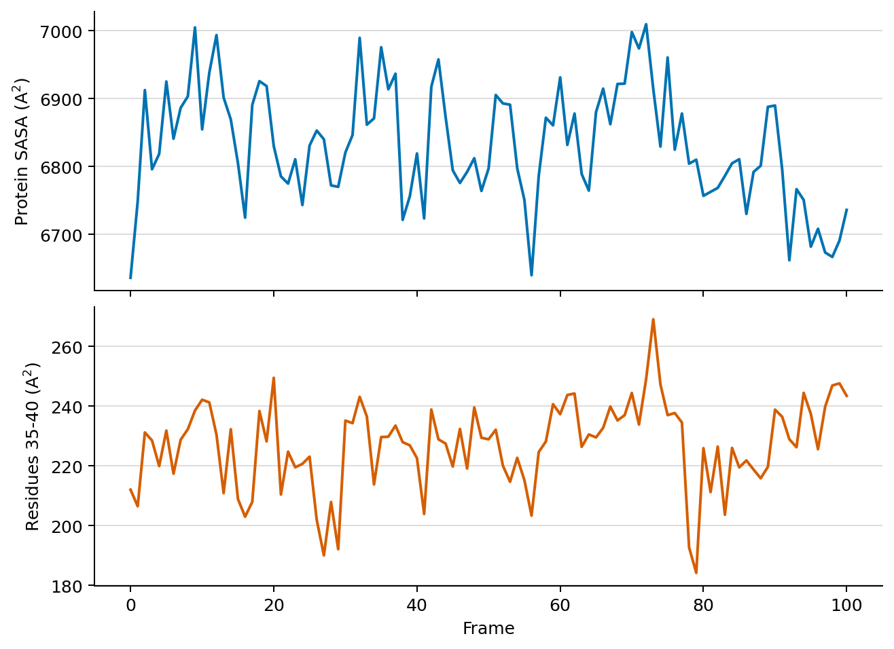

# Trajectory Analysis

FastSASA can calculate SASA over DCD and XTC trajectories directly from the CLI.
It reuses accelerator memory across frames instead of rebuilding a full structure for
every frame. This is what makes trajectory analysis the main GPU use case.

GPU-resident in FastSASA means reusable buffers, radii, topology metadata, and
working arrays stay on the GPU. It does not mean the whole trajectory is loaded
into VRAM. Coordinates are streamed in batches, which keeps the workflow usable
on consumer GPUs.

Backend selection is automatic (Vulkan, then CUDA, then threaded CPU) and can
be pinned with `--backend auto|vulkan|cuda|cpu`. A native threaded CPU path is
always available with `--backend cpu --threads N`; `--cpu` is shorthand for
`--backend cpu`.

## Recommended Command

For a protein trajectory:

```sh
fastsasa trajectory \
  --topology topology.pdb \
  --trajectory trajectory.xtc \
  --frames : \
  --filter protein \
  --output protein_sasa.csv
```

`--frames :` means process every frame. If `--batch-size` is omitted, FastSASA
chooses a conservative size for the active backend and trajectory. CUDA can
use multiple streams; Vulkan records one command buffer and performs one queue
submission per batch. Neither backend loads the whole trajectory into VRAM.
Use `--frames :N` when you want the first `N` frames for a quick benchmark or
smoke test.

Use an explicit batch size only for fixed benchmarking:

```sh
--batch-size 16
```

Use this same `fastsasa trajectory` command in scripts and benchmark tooling.
Older positional trajectory commands are still accepted for compatibility, but
new workflows should use explicit `--topology` and `--trajectory` options.
Trajectory resolution follows the same defaults as the structure CLI:
Shrake-Rupley uses 100 points and Lee-Richards uses 20 slices unless
`--resolution` is provided.

The solvent probe radius also follows the structure CLI default of `1.4`
Angstrom. Change it explicitly when needed:

```sh
--probe-radius 1.2
```

Both GPU algorithms use FP64 by default; in FP64, Vulkan and CUDA results
are bit-identical to the CPU reference. Add `--precision fp32` to opt into
the faster single-precision kernels. See the
[precision section of the CLI reference](cli.md) for the FP32 accuracy
bounds and the `shaderFloat64` requirement for Vulkan FP64.

CPU reference run:

```sh
fastsasa trajectory \
  --topology topology.pdb \
  --trajectory trajectory.xtc \
  --frames :100 \
  --batch-size 8 \
  --summary \
  --filter protein \
  --backend cpu --threads 8
```

## Input Formats

| Input | Native support |
| --- | --- |
| PDB topology | yes |
| mmCIF topology | yes |
| PSF topology | yes |
| DCD trajectory | yes |
| XTC trajectory | yes |
| Other trajectory formats | use MDAnalysis or MDTraj |

The accelerator API itself is format-neutral. Any reader that produces coordinate
arrays can feed FastSASA.

Runtime backend selection is automatic: Vulkan, then CUDA when compiled and
available, then threaded CPU. Use `--backend auto|vulkan|cuda|cpu` to pin a
backend from the CLI. The environment variable
`FASTSASA_BACKEND=auto|vulkan|cuda|cpu` makes the same choice for the C and
Python APIs; the flag and the environment variable are equivalent. Normal
workflows can leave both at `auto`.

## Explicit-Solvent MD

FastSASA always reads the complete topology so its atom order stays aligned with
the DCD/XTC coordinates. It then forms the SASA calculation universe:

- hydrogen atoms are excluded unless `--hydrogen` is used;
- PDB/mmCIF HETATM records are excluded unless `--hetatm` is used;
- `--filter`, when present, further limits the calculation universe.

This separation matters: removing atoms while parsing a topology would shift
trajectory indices and could attach coordinates to the wrong atoms.

PSF does not store the PDB ATOM/HETATM distinction. Hydrogen exclusion still
works from the atom element, but protein, ligand, lipid, water, and ion scope
must be expressed with `--filter`.

If you omit `--filter`, all atoms eligible under the hydrogen/HETATM policy
participate in SASA and FastSASA prints a warning.

For standard protein SASA from an explicit-solvent or membrane simulation:

```sh
--filter protein
```

For a protein-ligand complex:

```sh
--filter 'complex, protein or resn ABU'
```

For a PDB/mmCIF topology where the ligand is stored as HETATM, include those
records before filtering:

```sh
--hetatm --filter 'complex, protein or resn ABU'
```

For PSF topologies, select subunits by PSF segment name (`segid`) rather
than PDB chain — see the PSF segment naming notes in
[Selection Syntax](selection.md), which also covers the distinction between
`--filter` (what participates in the calculation) and `--select` (what is
reported).

If you are comparing against VMD `measure sasa`, check the atom radii
first — see the radius note in the [CLI Reference](cli.md).

## Frame Selection

`--frames` uses Python-style indexing:

| Spec | Meaning |
| --- | --- |
| `:` | all frames |
| `10` | only frame 10 |
| `10:20` | frames 10 through 19 |
| `10:20:2` | every second frame from 10 through 19 |
| `-1` | last frame |
| `-10:` | from the 10th-from-last frame through the last frame |

For the old “first N frames” behavior, use `--frames :N`.

DCD frame selection uses direct file seeking. XTC uses the same frame syntax;
depending on the available trajectory backend, jumping backward or to the last
frame may require reopening the stream and skipping frames.

## Output Modes

Summary output reports trajectory throughput and summed SASA:

```sh
fastsasa trajectory \
  --topology topology.psf \
  --trajectory trajectory.dcd \
  --summary \
  --filter protein \
  --output protein_sasa_summary.csv
```

Add `--classes` when you want the same trajectory output split into polar,
apolar, and unknown SASA classes:

```sh
fastsasa trajectory \
  --topology topology.psf \
  --trajectory trajectory.dcd \
  --frames : \
  --filter protein \
  --classes \
  --output protein_sasa_classes.csv
```

With `--select`, class columns are reported for each selected atom set:

```sh
fastsasa trajectory \
  --topology topology.psf \
  --trajectory trajectory.dcd \
  --filter protein \
  --select 'r677_ap, segid AP and resi 677' \
  --classes \
  --output r677_ap_sasa_classes.csv
```

`--classes` is a reporting split only. It does not change the geometric SASA
calculation.

Per-residue output:

```sh
fastsasa trajectory \
  --topology topology.pdb \
  --trajectory trajectory.xtc \
  --residue \
  --filter protein \
  --output residue_sasa.csv
```

If `--output` is omitted, trajectory CSV is written to stdout. Warnings and
errors are still written to stderr.



*Example FP64 Shrake-Rupley output for 101 trajectory frames. The upper panel
shows protein SASA; the lower panel reports residues 35-40 in that protein
context. FastSASA writes these values directly as per-frame CSV.*

## Coordinate Preparation

FastSASA does not wrap, unwrap, reimage, center, or reconstruct periodic
trajectories. Prepare coordinates upstream with the MD tool appropriate for
your workflow. The [MDAnalysis tutorial](tutorial_mdanalysis.md) shows the
Python path for transformations and complex selections. Coordinates must be
finite and should remain spatially compact. FastSASA rejects frames whose bounds
would require an impractically large dense cell grid instead of attempting a
multi-gigabyte allocation.
