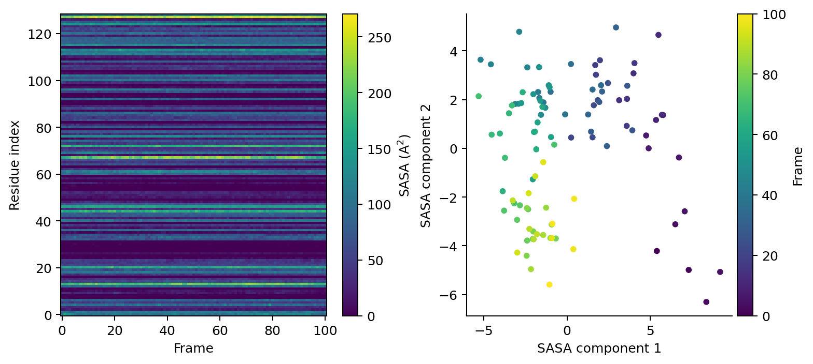

# Feature Extraction And ML Descriptors

FastSASA can convert trajectories into SASA-derived time series and compact frame
descriptors.

Feature extraction starts with one backend atom-SASA calculation per frame
batch, then reduces atoms into masks, residues, and summary statistics.
Interface burial and glycan shielding require additional SASA calculations
because they compare different atom contexts.

`n_points=100` (the default below) is a fast, coarse setting suitable for
exploratory work. Interface BSA in particular subtracts three SASA values, so
its error compounds; for production numbers, check convergence at higher
`n_points` (e.g. 260, 590, 960) before trusting small differences.

## Basic Feature Extraction

```python
from fastsasa import extract_md_features, flatten_statistics

features = extract_md_features(
    positions,
    radii,
    residue_ids=residue_ids,
    group_masks={"ligand_sasa": ligand_mask, "loop_sasa": loop_mask},
    hydrophobic_mask=hydrophobic_mask,
    polar_mask=polar_mask,
    probe_radius=1.4,
    n_points=100,
)

names, values = flatten_statistics(features["statistics"], prefix="sasa")
for name, value in zip(names, values):
    print(name, value)
```

Output shape:

```text
sasa.total_sasa.mean ...
sasa.total_sasa.variance ...
sasa.ligand_sasa.mean ...
sasa.loop_sasa.mean ...
```

## Available Feature Families

| Feature | Input |
| --- | --- |
| total SASA | always available |
| per-residue SASA | `residue_ids` |
| named group exposure (any atom group you define — a ligand, a loop, a domain, ...) | `group_masks={"name": mask, ...}` |
| hydrophobic exposed area | user-defined `hydrophobic_mask` |
| polar exposed area | user-defined `polar_mask` |
| backbone/sidechain SASA (whole-system and per-residue) | `atom_names` |
| relative SASA (RSA), mean/exposed/buried-residue fractions | `residue_ids` + `residue_names` |
| interface SASA and buried surface area | `interface_a_mask`, `interface_b_mask` |
| per-residue and polar/apolar interface burial | the above plus `residue_ids` (and `polar_mask`/`hydrophobic_mask` for the polar/apolar split) |
| glycan shielding | `glycan_mask`, `glycan_target_mask` |

`group_masks`, `hydrophobic_mask`, and `polar_mask` are the same mechanism
underneath — an arbitrary boolean atom mask summed into its own named
feature. `group_masks` is the general form: pick any name and any mask.
`hydrophobic_mask`/`polar_mask` are convenience names, not an automatic
chemical classifier. The caller defines both masks. For the atom-type split
stored in a radius configuration, use the CLI's `--classes` output.

For a genuinely different (non-generic) ligand/pocket feature — the actual
binding-interface physics, not just a named exposure sum — see
[Interface And Buried SASA](#interface-and-buried-sasa) below.

Summary statistics include:

- mean
- variance (population, `ddof=0`) and standard deviation
- minimum, maximum
- median, q05, q25, q75, q95, iqr (`q75 - q25`)
- mad: unscaled median absolute deviation, `median(|x - median(x)|)` (not
  multiplied by the 1.4826 normal-consistency constant)
- exposure frequency: fraction of frames where the feature is strictly
  greater than a threshold (`> threshold`, not `>=`)
- transition count: number of times the thresholded state changes between
  consecutive analyzed frames, with no hysteresis — a value oscillating
  around the threshold counts every crossing (see
  [Kinetics: Dwell Time And Transition Rate](#kinetics-dwell-time-and-transition-rate)
  below for a hysteresis-aware alternative plus dwell times)

`extract_md_features()` also returns a `metadata` dict (units, algorithm,
probe radius, `n_points`, and — when RSA is requested — the reference table
and exposed/buried threshold used) alongside `time_series`/`statistics`.

## Relative SASA And Backbone/Sidechain Split

```python
features = extract_md_features(
    positions,
    radii,
    residue_ids=residue_ids,
    residue_names=residue_names,   # one three-letter code per residue
    atom_names=atom_names,
    n_points=100,
)

rsa = features["time_series"]["per_residue_rsa"]           # (frames, residues)
mean_rsa = features["time_series"]["mean_rsa"]              # (frames,)
backbone = features["time_series"]["backbone_sasa"]         # (frames,)
```

`per_residue_rsa = per_residue_sasa / MaxASA(residue_type)`, using the
bundled ProtOr maximum-ASA reference table (the same one `--format rsa`
uses). This assumes ProtOr-compatible radii; it is not meaningful with a
materially different radius model. Residues outside the standard 20 amino
acids have no reference value and get `NaN` RSA — excluded from `mean_rsa`
and the exposed/buried fractions, not treated as zero.
`rsa_exposed_threshold` (default `0.25`, 25% relative accessibility) sets the
`exposed_residue_fraction`/`buried_residue_fraction` cutoff.

`atom_names` classifies backbone vs. sidechain using the same atom-name list
`--format rsa` uses (protein backbone plus nucleic-acid backbone atoms),
giving `backbone_sasa`/`sidechain_sasa` and, with `residue_ids`,
`per_residue_backbone_sasa`/`per_residue_sidechain_sasa`.

## Interface And Buried SASA

For protein-ligand, chain-chain, residue-residue, or pocket-ligand questions,
define two non-overlapping atom groups. FastSASA reports the SASA of each group
alone, the SASA after the two groups are calculated together, and the buried
surface area between them.

```python
from fastsasa import interface_sasa

interface = interface_sasa(
    positions,
    radii,
    group_a_mask=protein_mask,
    group_b_mask=ligand_mask,
    n_points=100,
)

buried = interface["interface_buried_sasa"]
half_buried = interface["interface_buried_sasa_half"]  # "half-BSA"
```

The isolated-partner values (`interface_a_free_sasa`, `interface_b_free_sasa`)
use each group's coordinates from the supplied frame with the other group
removed — not an independently simulated or experimentally determined unbound
structure. The result measures geometric burial at fixed conformation, not
a bound/unbound conformational change.

The main identity is:

```text
interface_buried_sasa = interface_a_free_sasa
                      + interface_b_free_sasa
                      - interface_complex_sasa
```

The same outputs are available through `extract_md_features()`:

```python
features = extract_md_features(
    positions,
    radii,
    interface_a_mask=protein_mask,
    interface_b_mask=ligand_mask,
)

buried = features["time_series"]["interface_buried_sasa"]
```

The groups are user-defined and should normally represent the complete two
binding partners. For a protein-ligand interface, pass the protein and ligand
masks. If group A is only a pocket subset, atoms outside that subset are not
part of the interface calculation; use that interpretation only when it is the
quantity you intend to measure.

`interface_buried_sasa` is the combined loss from both sides. Some interface
studies report half of that quantity; FastSASA exposes it explicitly as
`interface_buried_sasa_half`. Per-side losses are available as
`interface_a_buried_sasa` and `interface_b_buried_sasa`.

The combined value follows the interface delta-ASA definition used by Jones
and Thornton. The half value is provided because some earlier
protein-interface work reports one half of the two-sided loss. Always state
which convention is used when comparing values.

`interface_a_buried_fraction`/`interface_b_buried_fraction` normalize each
side's buried area by its own isolated SASA — comparable across partners of
different sizes, unlike the raw BSA values.

With `residue_ids` also supplied, `extract_md_features()` additionally
returns `per_residue_buried_sasa`/`per_residue_buried_fraction` (`NaN` for
residues with no atom at the interface — see the top-level
`interface_residue_mask`, not a `time_series` entry since it is per-residue,
not per-frame). With `polar_mask`/`hydrophobic_mask` also supplied, it
returns `interface_polar_buried_sasa`, `interface_apolar_buried_sasa`, and
`interface_apolar_fraction` — the *buried* area within each chemical class at
the interface, not the exposed area those masks give elsewhere.

## Glycan Shielding

When `glycan_mask` and `glycan_target_mask` are supplied, FastSASA calculates
the target SASA with the glycans present and again after removing glycan atoms:

```text
glycan_shielding = target_sasa_without_glycan - target_sasa_with_glycan
glycan_shielding_fraction = glycan_shielding / target_sasa_without_glycan
```

This measures shielding from a 1.4 Å solvent probe. It does not model the
larger footprint of an antibody or another macromolecular binder.

## SASA Fingerprints

A SASA fingerprint is a frame-by-feature matrix. A common default is
per-residue SASA over time.

```python
from fastsasa import extract_md_features, sasa_fingerprint_matrix

features = extract_md_features(
    positions,
    radii,
    residue_ids=residue_ids,
    n_residues=n_residues,
)

fingerprints = sasa_fingerprint_matrix(
    features,
    keys=("per_residue_sasa",),
    normalize="zscore",
)

print(fingerprints["matrix"].shape)
```

Expected output shape:

```text
(n_frames, n_residues)
```

## Embedding Fingerprints

```python
from fastsasa import embed_sasa_fingerprints

embedding = embed_sasa_fingerprints(
    fingerprints["matrix"],
    n_components=2,
)

print(embedding["embedding"].shape)
print(embedding["explained_variance_ratio"])
```

Expected output shape:

```text
(n_frames, 2)
[... ...]
```

The embedding is an SVD/PCA-style projection: centered by default
(`center=True`), not scaled to unit variance (`scale=False`). It is useful
for clustering, rare-state detection, frame selection, or comparing
simulations by exposure state. `embed_sasa_fingerprints()` recomputes the
projection from scratch on every call. For a projection you fit once and
apply to held-out trajectories, use `SasaFingerprintEmbedder` instead (below).



*Example residue-level SASA output from a 101-frame trajectory. The heat map
shows which residues change exposure; the embedding represents each frame by
its complete residue-SASA pattern. Values and clusters depend on the selected
atoms, radii, resolution, and trajectory.*

## Persisted Embeddings (Fit/Transform)

```python
from fastsasa import SasaFingerprintEmbedder

embedder = SasaFingerprintEmbedder(n_components=2, center=True, scale=False)
train_embedding = embedder.fit_transform(train_fingerprints["matrix"])
held_out_embedding = embedder.transform(held_out_fingerprints["matrix"])
```

`fit_transform(x)` gives the same result as `embed_sasa_fingerprints(x)`. The
value of the class is `transform()`: it applies the mean/scale/components
learned during `fit()` to new data, using the standard out-of-sample PCA
projection (`(x - mean) / scale @ components.T`), instead of computing an
independent — and not directly comparable — SVD per trajectory. Fitted state
is available as `embedder.mean_`, `embedder.scale_`, `embedder.components_`,
`embedder.singular_values_`, and `embedder.explained_variance_ratio_`.
`transform()` before `fit()`/`fit_transform()` raises `RuntimeError`; a
feature-count mismatch raises `ValueError`.

## Kinetics: Dwell Time And Transition Rate

```python
from fastsasa import exposure_kinetics

kinetics = exposure_kinetics(
    features["time_series"]["total_sasa"],
    threshold=1500.0,
    hysteresis=50.0,
    frame_interval=1.0,
)

kinetics["exposed_dwell_time_mean"]
kinetics["buried_dwell_time_mean"]
kinetics["exposure_transition_rate"]
```

`summarize_time_series()`'s `transitions` counts every crossing of a single
threshold — noise sitting near the threshold inflates the count. Set
`hysteresis` to require the value to clear a band above/below `threshold`
before the state flips (a Schmitt trigger): the state only goes buried→exposed
above `threshold + hysteresis`, and exposed→buried at or below `threshold -
hysteresis`. With `hysteresis=0.0`, `exposure_kinetics()`'s `transitions`
matches `summarize_time_series()`'s exactly.

Dwell-time means exclude the first and last run of each feature — both are
truncated by the trajectory boundary (the real run may extend outside the
analyzed window), and including them biases the mean downward. A feature with
no complete interior run of a given state gets `NaN` for that state's dwell
mean. `frame_interval` scales frame counts into a physical time unit;
`exposure_transition_rate` is transitions per unit time over the analyzed
span (`NaN` for a single-frame series).

## Uncertainty: Autocorrelation Time And Standard Error

```python
from fastsasa import time_series_uncertainty

uncertainty = time_series_uncertainty(features["time_series"]["total_sasa"])

uncertainty["autocorrelation_time"]
uncertainty["effective_sample_size"]
uncertainty["standard_error"]
uncertainty["block_standard_error"]
```

Consecutive MD frames are correlated, so the naive `std(x) / sqrt(n_frames)`
standard error of a time-series mean is too small. `autocorrelation_time` is
the integrated autocorrelation time (`tau = 1 + 2 * sum(rho_k)`, summed until
the lag-`k` normalized autocovariance first goes negative, or 1000 lags,
whichever comes first); `effective_sample_size` is `n_frames / tau`;
`standard_error` is `std(x, ddof=1) * sqrt(tau / n_frames)`.
`block_standard_error` is an independent, model-free cross-check computed by
splitting the series into `round(sqrt(n_frames))`-sized blocks (default) and
taking the standard error of the block means. Both return `NaN` below the
minimum data needed to estimate them (8 frames for the autocorrelation-based
estimates, 2 complete blocks for `block_standard_error`) rather than a
meaningless number — always check for `NaN` before trusting these on short
series.

## Scientific References

- Tsai J, Taylor R, Chothia C, Gerstein M. *The packing density in proteins:
  standard radii and volumes.* J Mol Biol. 1999.
  [doi:10.1006/jmbi.1999.2829](https://doi.org/10.1006/jmbi.1999.2829)
- Chothia C, Janin J. *Principles of protein-protein recognition.* Nature.
  1975. [doi:10.1038/256705a0](https://doi.org/10.1038/256705a0)
- Jones S, Thornton JM. *Principles of protein-protein interactions.* PNAS.
  1996. [doi:10.1073/pnas.93.1.13](https://doi.org/10.1073/pnas.93.1.13)

## Example Scripts

```sh
python examples/mdanalysis_features.py topology.psf trajectory.dcd \
  --selection "protein or resname ABU" \
  --interface-a-selection "protein" \
  --interface-b-selection "resname ABU"

python examples/mdanalysis_fingerprint.py topology.psf trajectory.dcd \
  --selection protein \
  --components 2 \
  --normalize zscore

python examples/mdtraj_features.py trajectory.xtc \
  --topology topology.pdb \
  --interface-a-selection "protein" \
  --interface-b-selection "resname ABU"
```
